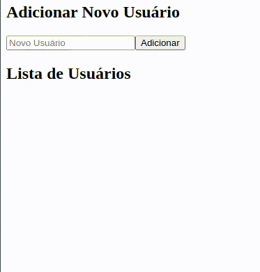

# Exemplo de Services em Angular

## Funcionamento



## Explicação da implementação

### Criação do Serviço:
O serviço UserService foi criado para gerenciar a lista de usuários. Ele fornece métodos para obter a lista de usuários (`getUsers()`) e adicionar um novo usuário ().

```typescript
// user.service.ts
import { Injectable } from '@angular/core';

@Injectable({
  providedIn: 'root',
})
export class UserService {
  private users: string[] = [];

  getUsers(): string[] {
    return this.users;
  }

  addUser(user: string): void {
    this.users.push(user);
  }
}
```

### Integração do Serviço:
O serviço foi injetado no componente UserListComponent para obter a lista de usuários durante a inicialização do componente. O método getUsers() do serviço é chamado no método `ngOnInit()`.

O serviço também foi injetado no componente AddUserComponent para adicionar novos usuários à lista. O método `addUser()` do componente chama o método `addUser(user: string)` do serviço.

Com essa configuração, os componentes UserListComponent e AddUserComponent podem interagir com o serviço UserService para obter a lista de usuários e adicionar novos usuários, respectivamente. O serviço atua como uma camada intermediária que gerencia o estado e a lógica de negócios compartilhados entre esses componentes.